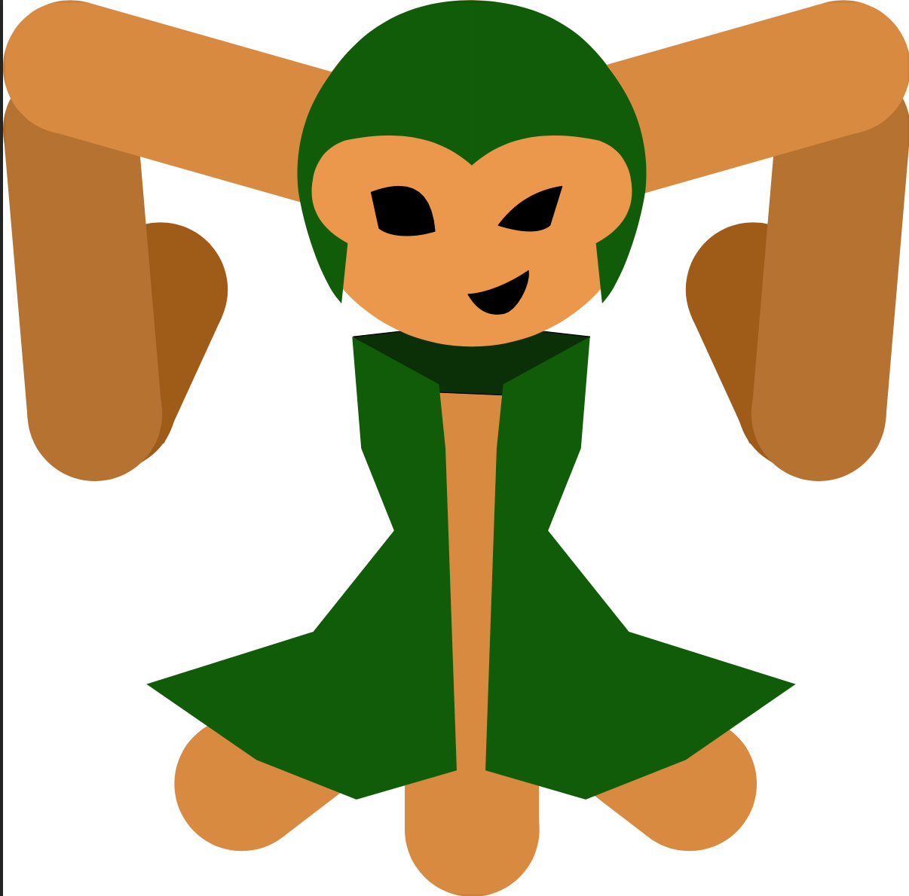
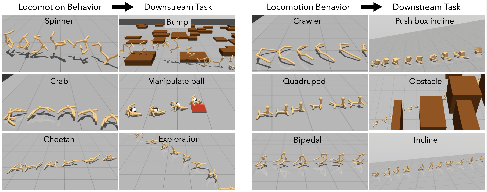

# Convergent Functions, Divergent Forms

<table width="100%">
<tr><td align="center">
  
  <div><em>Figure 1: <strong>LOKI</strong>  discovers high-performing morphologies with <b>diverse locomotion behaviors</b>.</em></div>
</td></tr>
</table>

<table width="100%">
<tr><td align="center">
  
  <div><em>Figure 2: Diverse forms effectively
generalize across various <b>unseen tasks</b>.</em></div>
</td></tr>
</table>


> __Convergent Functions, Divergent Forms__  
> [Hyeonseong Jeon](https://yeonsumia.github.io)\*, [Ainaz Eftekhar](https://ainaz99.github.io)\*, [Aaron Walsman](https://aaronwalsman.com), [Kuo-Hao Zeng](https://kuohaozeng.github.io), [Ali Farhadi](https://homes.cs.washington.edu/~ali), [Ranjay Krishna](https://www.ranjaykrishna.com/index.html)  
> _preprint_  
> __[Project page](https://loki-codesign.github.io)&nbsp;/ [arXiv](https://arxiv.org/abs/2505.21665)&nbsp;/ [BibTex](#citation)__

We introduce <strong>LOKI</strong> , a compute-efficient framework for co-designing morphologies and control policies that generalize across unseen tasks. 
Inspired by biological adaptation—where animals quickly adjust to morphological changes—our method overcomes the inefficiencies of traditional evolutionary and quality-diversity algorithms.
We propose learning <i>convergent functions</i>: shared control policies trained across clusters of morphologically similar designs in a learned latent space, drastically reducing the training cost per design. 
Simultaneously, we promote <i>divergent forms</i> by replacing mutation with dynamic local search, enabling broader exploration and preventing premature convergence. 
The policy reuse allows us to explore ~780&times; more designs using 78\% fewer simulation steps and 40\% less compute per design. 
Local competition paired with a broader search results in a diverse set of high-performing final morphologies.
Using the UNIMAL design space and a flat-terrain locomotion task, <strong>LOKI</strong>  discovers a rich variety of designs—ranging from quadrupeds to crabs, bipedals, and spinners—far more diverse than those produced by prior work. These morphologies also transfer better to unseen downstream tasks in agility, stability, and manipulation domains (e.g. ~2&times; higher reward on <i>bump</i> and <i>push box incline</i> tasks). 
Overall, our approach produces designs that are both diverse and adaptable, with substantially greater sample efficiency than existing co-design methods.

## Installation
Download [Mujoco](https://mujoco.org/) from the official website and also obtain the license key. Unzip the downloaded mujoco210 directory into `~/.mujoco/mujoco210`. Update `bashrc`/`zshrc` by adding the following line and source it:
```bash
export LD_LIBRARY_PATH="~/.mujoco/mujoco210/bin:$LD_LIBRARY_PATH"
```
Create conda environment:
```bash
conda env create --file environment.yaml
conda activate loki
```
Install pip dependencies:
```bash
CONDA_PREFIX=$(conda info --base)
export CFLAGS="-I$CONDA_PREFIX/include"
export LDFLAGS="-L$CONDA_PREFIX/lib"
python -m pip install mujoco-py "cython<3"
```

## Create Dataset
Create random morphologies and build dataset `webdataset.tar`:
```bash
# bash scripts/evolve_init_xmls.sh <save_dir> <seed> <min_num_limbs> <max_num_limbs> <init_population_size>
# Adjust <init_population_size> to produce a larger dataset
bash scripts/evolve_init_xmls.sh webdataset 3429 4 10 50000
# Convert to webdataset.tar
bash scripts/data_2_wds.sh webdataset
```

## Construct Morphology Latent Clusters
Train morphology VAE:
```bash
bash scripts/train_vae.sh
```

Construct latent clusters based on learned morphology embeddings using the K-means algorithm:
```bash
# bash scripts/make_clusters.sh <num_clusters>
bash scripts/make_clusters.sh 40
```

To check the distribution of each latent cluster, run:
```bash
# bash scripts/get_info_clusters.sh <num_clusters>
bash scripts/get_info_clusters.sh 40
```

## Cluster-based Evolution
Run <strong>LOKI</strong>  on flat-terrain:
```bash
# bash scripts/train_loki.sh <num_walkers> <num_clusters> <cluster_index> <seed>
bash scripts/train_loki.sh 20 40 0 3429 # run for each <cluster_index> in {0..39} (e.g. cluster40/idx0)
```

In case a run crashes, use the following script to continue training:
```bash
# bash scripts/train_loki_resume.sh <num_walkers> <num_clusters> <cluster_index> <seed> <resume_iteration>
bash scripts/train_loki_resume.sh 20 40 14 3429 500 # (e.g. crash for <cluster_index>=14 at 500th iteration)
```

In main paper, we evaluate the top 2–3 evolved agents from each cluster based on their training rewards in the multi-agent policy model.
Before running the script, make sure to manually define `IDX_MAP` in the script according to the training results.
```bash
# bash scripts/save_loki_top_agents.sh <num_clusters> <seed>
bash scripts/save_loki_top_agents.sh 40 3429
```

## Unseen Task Evaluation
The evolved agents are evaluated from scratch based on their training rewards on a set of diverse, unseen tasks: `obstacle`, `many_obstacle`, `bump`, `patrol`, `incline`, `push_box_incline`, `manipulation_ball`, `exploration`. The following script supports parallelized training of all agents in <xml_dir>. For example, setting <num_nodes>=5 will manually divide the 100 agents into 5 groups, with 20 agents trained per run. Make sure each run uses dedicated CPU resources.
```bash
# bash scripts/eval_agents.sh <base_dir> <xml_dir> <task> <num_nodes> <node_index>
bash scripts/eval_agents.sh ../metamorph/output/loki/ft/kmeans_cluster/40 top_100_agents/xml obstacle 1 0 # train top-100 agents on obstacle task w/o parallelization)
```

To view the top‑k agents for each test task, run:
```bash
# bash scripts/get_top_eval_agents.sh <base_dir> <task> <top_k>
bash scripts/get_top_eval_agents.sh ../metamorph/output/loki/ft/kmeans_cluster/40 obstacle 10 # (e.g. top-10 agents on obstacle task)
```

## Fine-tune Multi-agent Policy
We evaluate the generalization capabilities of multi-agent policies across four tasks: `many_obstacle`, `bump`, `incline`, `push_box_incline`. In main paper, the top 10 clusters—ranked by training rewards on flat-terrain—are fine-tuned using a new decoder component.
```bash
# bash scripts/finetune_loki.sh <num_walkers> <num_clusters> <cluster_index> <seed> <task>
bash scripts/finetune_loki.sh 20 40 0 3429 bump # run for each of the top 10 clusters (e.g. cluster40/idx0)
```

## Citation
If you find <strong>LOKI</strong>  helpful, please consider citing:
```bibtex
@article{jeon2025convergent,
  title={Convergent Functions, Divergent Forms},
  author={Jeon, Hyeonseong and Eftekhar, Ainaz and Walsman, Aaron and Zeng, Kuo-Hao and Farhadi, Ali and Krishna, Ranjay},
  journal={arXiv preprint arXiv:2505.21665},
  year={2025}
}
```

## Acknowledgement
This codebase is built upon the foundations of [metamorph](https://github.com/agrimgupta92/metamorph), [derl](https://github.com/agrimgupta92/derl) and [tabsyn](https://github.com/amazon-science/tabsyn).
